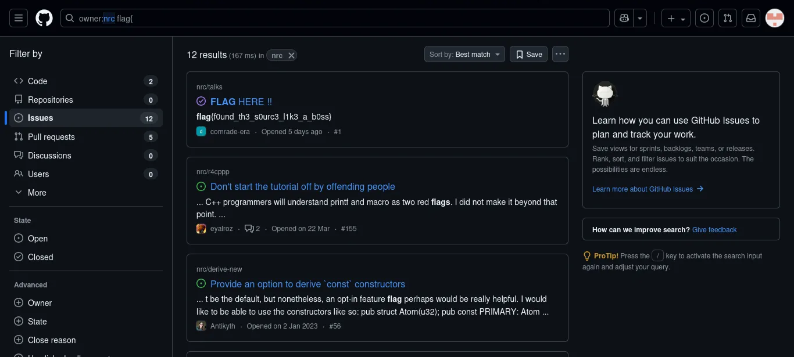

# Web

## Challenge Name : The Acme Corp

The flags are in segmented format :

The first part was found in client side html code :  
```html
<!-- build artifact:
       [1/5]=S3GM
       (note to self: admin panel moved, TODO remove robots entries)
  -->
```

The Second part was in style.css :
```css
/* build note:
   [2/5]=3NT_
*/
```

The third part was in app.js :
```text
build scratchpad:
   The release engineer left fragments here but reversed to be "compact":
   ]'3/5[' = ]'3R0F'[  // reversed Correct : F0R3
  */
```

The fourth part was in robots.txt :
```note
audit note:
# [4/5]=NS1C
```

The fifth part was in .htaccess :
```
#[5/5]=S
```
Final Flag : `flag{S3GM3NT_F0R3NS1CS}` **S was missing in the part**

# Crypto

## Shadows in the Wall 

We got a hex encoded text :
`2E2525233E233C3C31201E203D0C3D2F2D0B232C3D39`

First decode this from hex
Then from description we take first letter of each sentence then formed the key for **XOR**
which is `HIDDENINPLAINSIGHT`

flag : `flag{mural_is_the_key}`

## x^2+y^2=5 

This is a jsfive code 
```js
[$$=[+[]]]+[$$[++[[]][+[]]]=+[]]+[$$=[$$+[]][+[]][++[[]][+[]]]]+[$$$=[$[[[]+[][+[]]][+[]][++[++[++[++[[]][+[]]][+[]]][+[]]][+[]]]+[[]+[][+[]]][+[]][++[++[++[++[++[[]][+[]]][+[]]][+[]]][+[]]][+[]]]+[[]+[][+[]]][+[]][++[[]][+[]]]+[[]+[][+[]]][+[]][++[++[[]][+[]]][+[]]]]+[]][+[]]]+[$$$$=[$[[[]+[][+[]]][+[]][++[++[[]][+[]]][+[]]]+$$$[+[[++[++[++[++[++[[]][+[]]][+[]]][+[]]][+[]]][+[]]]+[++[++[++[++[++[++[[]][+[]]][+[]]][+[]]][+[]]][+[]]][+[]]]]]+$$$[++[++[++[++[[]][+[]]][+[]]][+[]]][+[]]]+$$$[+[[++[[]][+[]]]+[++[++[++[++[[]][+[]]][+[]]][+[]]][+[]]]]]+$$$[+[[++[++[++[++[++[++[++[++[++[[]][+[]]][+[]]][+[]]][+[]]][+[]]][+[]]][+[]]][+[]]][+[]]]+[++[++[++[++[++[++[++[++[[]][+[]]][+[]]][+[]]][+[]]][+[]]][+[]]][+[]]][+[]]]]]+[[]+[][+[]]][+[]][++[++[++[++[++[[]][+[]]][+[]]][+[]]][+[]]][+[]]]+$$$[++[++[++[[]][+[]]][+[]]][+[]]]+$$$[+[[++[++[++[++[++[++[++[++[++[[]][+[]]][+[]]][+[]]][+[]]][+[]]][+[]]][+[]]][+[]]][+[]]]+[++[++[++[++[++[++[[]][+[]]][+[]]][+[]]][+[]]][+[]]][+[]]]+[++[++[[]][+[]]][+[]]]]]+$$$[+[[++[[]][+[]]]+[++[++[++[++[[]][+[]]][+[]]][+[]]][+[]]]]]+$$$[+[[++[++[[]][+[]]][+[]]]+[++[++[++[++[[]][+[]]][+[]]][+[]]][+[]]]]]][[[]+[][+[]]][+[]][++[++[[]][+[]]][+[]]]+$$$[+[[++[++[++[++[++[++[++[++[++[[]][+[]]][+[]]][+[]]][+[]]][+[]]][+[]]][+[]]][+[]]][+[]]]+[++[++[++[++[++[++[++[++[[]][+[]]][+[]]][+[]]][+[]]][+[]]][+[]]][+[]]][+[]]]]]+$$$[+[[++[[]][+[]]]+[++[++[++[++[++[[]][+[]]][+[]]][+[]]][+[]]][+[]]]+[++[++[++[++[[]][+[]]][+[]]][+[]]][+[]]]]]+[[]+[][+[]]][+[]][++[++[++[++[++[[]][+[]]][+[]]][+[]]][+[]]][+[]]]+$$$[+[[++[++[++[++[++[[]][+[]]][+[]]][+[]]][+[]]][+[]]]+[++[++[++[++[++[[]][+[]]][+[]]][+[]]][+[]]][+[]]]]]]][+[]][+[]]]+[$$$$$=$$$[++[++[++[++[++[++[[]][+[]]][+[]]][+[]]][+[]]][+[]]][+[]]]+$$$[++[[]][+[]]]+$$$[++[++[++[++[[]][+[]]][+[]]][+[]]][+[]]]+$$$[+[[++[[]][+[]]]+[++[++[++[++[[]][+[]]][+[]]][+[]]][+[]]]]]+$$$[+[[++[++[[]][+[]]][+[]]]+[++[++[++[++[[]][+[]]][+[]]][+[]]][+[]]]]]+$$$[+[[++[++[++[++[++[[]][+[]]][+[]]][+[]]][+[]]][+[]]]+[++[++[++[++[++[[]][+[]]][+[]]][+[]]][+[]]][+[]]]+[++[++[++[++[++[++[++[++[[]][+[]]][+[]]][+[]]][+[]]][+[]]][+[]]][+[]]][+[]]]]]+$$$[+[[++[[]][+[]]]+[++[++[++[++[++[++[++[[]][+[]]][+[]]][+[]]][+[]]][+[]]][+[]]][+[]]]+[++[++[++[++[[]][+[]]][+[]]][+[]]][+[]]]]]+$$$[+[[++[++[++[++[++[[]][+[]]][+[]]][+[]]][+[]]][+[]]]+[++[++[++[++[++[++[[]][+[]]][+[]]][+[]]][+[]]][+[]]][+[]]]+[+[]]]]+$$$[+[[++[++[++[++[++[[]][+[]]][+[]]][+[]]][+[]]][+[]]]+[++[++[++[++[++[++[[]][+[]]][+[]]][+[]]][+[]]][+[]]][+[]]]+[++[[]][+[]]]]]]+[$$$$[$$$[++[++[++[++[++[++[[]][+[]]][+[]]][+[]]][+[]]][+[]]][+[]]]+$$$[+[[++[[]][+[]]]+[+[]]+[++[++[++[++[[]][+[]]][+[]]][+[]]][+[]]]]]+[[]+[][+[]]][+[]][++[[]][+[]]]+$$$[+[[++[[]][+[]]]+[++[++[++[++[[]][+[]]][+[]]][+[]]][+[]]]]]+$$$[+[[++[++[[]][+[]]][+[]]]+[++[++[++[++[[]][+[]]][+[]]][+[]]][+[]]]]]+$$$[+[[++[[]][+[]]]+[++[++[++[++[++[[]][+[]]][+[]]][+[]]][+[]]][+[]]]+[++[++[++[++[[]][+[]]][+[]]][+[]]][+[]]]]]+$$$[++[++[++[++[++[++[[]][+[]]][+[]]][+[]]][+[]]][+[]]][+[]]]+$$$[++[++[++[[]][+[]]][+[]]][+[]]]+$$$[++[[]][+[]]]+$$$[+[[++[++[++[++[++[[]][+[]]][+[]]][+[]]][+[]]][+[]]]+[++[++[++[++[++[++[++[++[++[[]][+[]]][+[]]][+[]]][+[]]][+[]]][+[]]][+[]]][+[]]][+[]]]]]+$$$[+[[++[[]][+[]]]+[++[++[++[++[[]][+[]]][+[]]][+[]]][+[]]]]]+[[]+[][+[]]][+[]][++[[]][+[]]]+$$$[++[++[++[++[[]][+[]]][+[]]][+[]]][+[]]]][$$$[+[[++[[]][+[]]]+[++[[]][+[]]]+[++[++[++[++[++[++[++[[]][+[]]][+[]]][+[]]][+[]]][+[]]][+[]]][+[]]]+[++[++[++[++[++[++[++[++[[]][+[]]][+[]]][+[]]][+[]]][+[]]][+[]]][+[]]][+[]]]]]+$$$[++[++[++[++[++[++[[]][+[]]][+[]]][+[]]][+[]]][+[]]][+[]]]+[[]+[][+[]]][+[]][++[++[[]][+[]]][+[]]]+$$$[+[[++[[]][+[]]]+[++[++[++[++[++[++[++[[]][+[]]][+[]]][+[]]][+[]]][+[]]][+[]]][+[]]]+[++[++[++[++[++[[]][+[]]][+[]]][+[]]][+[]]][+[]]]]]][[[]+[][+[]]][+[]][++[++[++[++[++[[]][+[]]][+[]]][+[]]][+[]]][+[]]]+[[]+[][+[]]][+[]][++[[]][+[]]]+[[]+[][+[]]][+[]][++[[]][+[]]]+$$$[+[[++[[]][+[]]]+[++[++[++[++[[]][+[]]][+[]]][+[]]][+[]]]]]+$$$[+[[++[++[[]][+[]]][+[]]]+[++[++[++[++[[]][+[]]][+[]]][+[]]][+[]]]]]+$$$[+[[++[++[++[++[++[[]][+[]]][+[]]][+[]]][+[]]][+[]]]+[++[++[++[++[++[[]][+[]]][+[]]][+[]]][+[]]][+[]]]+[++[++[++[++[++[++[++[++[[]][+[]]][+[]]][+[]]][+[]]][+[]]][+[]]][+[]]][+[]]]]]+$$$[+[[++[[]][+[]]]+[++[++[++[++[++[++[++[[]][+[]]][+[]]][+[]]][+[]]][+[]]][+[]]][+[]]]+[++[++[++[++[[]][+[]]][+[]]][+[]]][+[]]]]]+$$$[+[[++[++[++[++[++[[]][+[]]][+[]]][+[]]][+[]]][+[]]]+[++[++[++[++[++[++[[]][+[]]][+[]]][+[]]][+[]]][+[]]][+[]]]+[+[]]]]+$$$[+[[++[++[++[++[++[[]][+[]]][+[]]][+[]]][+[]]][+[]]]+[++[++[++[++[++[++[[]][+[]]][+[]]][+[]]][+[]]][+[]]][+[]]]+[++[[]][+[]]]]]]+=$$$$[$$$$$][+[]]+[[]+[][+[]]][+[]][++[++[++[++[++[[]][+[]]][+[]]][+[]]][+[]]][+[]]]+$$$[+[[++[++[++[++[++[[]][+[]]][+[]]][+[]]][+[]]][+[]]]+[++[++[++[++[++[++[++[++[++[[]][+[]]][+[]]][+[]]][+[]]][+[]]][+[]]][+[]]][+[]]][+[]]]]]+$$$[+[[++[++[++[++[++[++[++[++[++[[]][+[]]][+[]]][+[]]][+[]]][+[]]][+[]]][+[]]][+[]]][+[]]]+[++[++[++[++[[]][+[]]][+[]]][+[]]][+[]]]]]+$$$[++[++[++[++[++[++[++[++[[]][+[]]][+[]]][+[]]][+[]]][+[]]][+[]]][+[]]][+[]]]+$$$[+[[++[[]][+[]]]+[++[++[++[++[++[++[++[[]][+[]]][+[]]][+[]]][+[]]][+[]]][+[]]][+[]]]]]+$$$[+[[++[++[[]][+[]]][+[]]]+[++[++[++[++[[]][+[]]][+[]]][+[]]][+[]]]]]+$$$[++[++[++[[]][+[]]][+[]]][+[]]]+$$$[++[++[++[++[++[++[++[++[[]][+[]]][+[]]][+[]]][+[]]][+[]]][+[]]][+[]]][+[]]]+$$$[++[++[++[++[++[++[[]][+[]]][+[]]][+[]]][+[]]][+[]]][+[]]]+[[]+[][+[]]][+[]][++[[]][+[]]]+$$$[+[[++[[]][+[]]]+[++[++[++[++[[]][+[]]][+[]]][+[]]][+[]]]]]+$$$[+[[++[++[[]][+[]]][+[]]]+[++[++[++[++[[]][+[]]][+[]]][+[]]][+[]]]]]+$$$[+[[++[++[[]][+[]]][+[]]]+[++[++[++[++[[]][+[]]][+[]]][+[]]][+[]]]]]+$$$[++[++[++[++[++[++[[]][+[]]][+[]]][+[]]][+[]]][+[]]][+[]]]+$$$[+[[++[++[[]][+[]]][+[]]]+[++[++[++[++[[]][+[]]][+[]]][+[]]][+[]]]]]+$$$$[$$$$$][++[++[++[++[++[++[++[[]][+[]]][+[]]][+[]]][+[]]][+[]]][+[]]][+[]]]+$$$$[$$$$$][++[++[++[++[++[++[++[++[[]][+[]]][+[]]][+[]]][+[]]][+[]]][+[]]][+[]]][+[]]]+$$$[+[[++[[]][+[]]]+[++[++[++[++[[]][+[]]][+[]]][+[]]][+[]]]]]+$$$[+[[++[++[++[++[++[[]][+[]]][+[]]][+[]]][+[]]][+[]]]+[++[++[++[++[++[[]][+[]]][+[]]][+[]]][+[]]][+[]]]]]+$$$[+[[++[++[++[++[++[[]][+[]]][+[]]][+[]]][+[]]][+[]]]+[++[++[++[++[++[++[[]][+[]]][+[]]][+[]]][+[]]][+[]]][+[]]]]]+$$$[+[[++[[]][+[]]]+[++[++[++[[]][+[]]][+[]]][+[]]]]]+$$$[+[[++[[]][+[]]]+[++[++[++[++[++[[]][+[]]][+[]]][+[]]][+[]]][+[]]]]]+$$[$$$[++[++[++[[]][+[]]][+[]]][+[]]]+$$$[++[++[++[++[++[++[[]][+[]]][+[]]][+[]]][+[]]][+[]]][+[]]]+[[]+[][+[]]][+[]][++[[]][+[]]]+$$$[+[[++[[]][+[]]]+[++[++[++[++[++[++[++[[]][+[]]][+[]]][+[]]][+[]]][+[]]][+[]]][+[]]]]]+$$$[++[++[++[++[[]][+[]]][+[]]][+[]]][+[]]]+$$$[+[[++[++[[]][+[]]][+[]]]+[++[++[++[++[[]][+[]]][+[]]][+[]]][+[]]]]]+$$$[++[[]][+[]]]+$$$[++[++[++[[]][+[]]][+[]]][+[]]]+$$$[++[++[++[++[[]][+[]]][+[]]][+[]]][+[]]]+$$$[++[++[++[++[++[++[[]][+[]]][+[]]][+[]]][+[]]][+[]]][+[]]]+$$$[+[[++[++[[]][+[]]][+[]]]+[++[++[++[++[[]][+[]]][+[]]][+[]]][+[]]]]]][[[]+[][+[]]][+[]][++[[]][+[]]]+$$$[+[[++[++[++[++[++[[]][+[]]][+[]]][+[]]][+[]]][+[]]]+[++[++[++[++[++[++[[]][+[]]][+[]]][+[]]][+[]]][+[]]][+[]]]]]+$$$[+[[++[++[++[++[++[[]][+[]]][+[]]][+[]]][+[]]][+[]]]+[++[++[++[++[++[++[++[++[++[[]][+[]]][+[]]][+[]]][+[]]][+[]]][+[]]][+[]]][+[]]][+[]]]]]+$$$[+[[++[[]][+[]]]+[++[++[++[++[[]][+[]]][+[]]][+[]]][+[]]]]]]+$$$[+[[++[[]][+[]]]+[++[++[++[++[[]][+[]]][+[]]][+[]]][+[]]]+[++[++[++[++[++[++[++[++[[]][+[]]][+[]]][+[]]][+[]]][+[]]][+[]]][+[]]][+[]]]]]+[[]+[][+[]]][+[]][++[++[++[++[[]][+[]]][+[]]][+[]]][+[]]]+$$$[+[[++[++[[]][+[]]][+[]]]+[++[++[++[++[[]][+[]]][+[]]][+[]]][+[]]]]]+$$$[++[++[++[++[++[++[[]][+[]]][+[]]][+[]]][+[]]][+[]]][+[]]]+$$$[+[[++[++[++[++[++[[]][+[]]][+[]]][+[]]][+[]]][+[]]]+[++[++[++[++[++[++[++[++[++[[]][+[]]][+[]]][+[]]][+[]]][+[]]][+[]]][+[]]][+[]]][+[]]]]]+$$$[+[[++[[]][+[]]]+[++[++[[]][+[]]][+[]]]+[+[]]]]+$$$[+[[++[++[++[++[++[++[++[++[++[[]][+[]]][+[]]][+[]]][+[]]][+[]]][+[]]][+[]]][+[]]][+[]]]+[++[[]][+[]]]]]+$$$[+[[++[++[++[++[++[[]][+[]]][+[]]][+[]]][+[]]][+[]]]+[++[++[++[++[++[++[[]][+[]]][+[]]][+[]]][+[]]][+[]]][+[]]]]]+$$$[+[[++[++[[]][+[]]][+[]]]+[++[++[++[++[[]][+[]]][+[]]][+[]]][+[]]]]]+$$$[+[[++[[]][+[]]]+[++[++[[]][+[]]][+[]]]+[+[]]]]+$$$[++[++[++[++[++[++[[]][+[]]][+[]]][+[]]][+[]]][+[]]][+[]]]+[[]+[][+[]]][+[]][++[++[[]][+[]]][+[]]]+$$$[+[[++[[]][+[]]]+[++[++[++[++[[]][+[]]][+[]]][+[]]][+[]]]]]+$$$[+[[++[[]][+[]]]+[++[++[++[++[++[[]][+[]]][+[]]][+[]]][+[]]][+[]]]]]+[[+[[++[++[++[++[++[++[++[++[++[[]][+[]]][+[]]][+[]]][+[]]][+[]]][+[]]][+[]]][+[]]][+[]]]+[++[++[++[++[++[++[++[[]][+[]]][+[]]][+[]]][+[]]][+[]]][+[]]][+[]]]]][+[]]+$$+[+[[++[[]][+[]]]+[+[]]+[++[++[++[++[++[++[++[++[[]][+[]]][+[]]][+[]]][+[]]][+[]]][+[]]][+[]]][+[]]]]][+[]]+$$+[+[[++[[]][+[]]]+[+[]]+[++[[]][+[]]]]][+[]]+$$+[+[[++[[]][+[]]]+[++[[]][+[]]]+[++[++[++[++[[]][+[]]][+[]]][+[]]][+[]]]]][+[]]+$$+[+[[++[[]][+[]]]+[++[[]][+[]]]+[++[++[++[++[++[++[[]][+[]]][+[]]][+[]]][+[]]][+[]]][+[]]]]][+[]]+$$+[+[[++[++[++[++[[]][+[]]][+[]]][+[]]][+[]]]+[+[]]]][+[]]+$$+[+[[++[++[++[[]][+[]]][+[]]][+[]]]+[++[++[++[++[[]][+[]]][+[]]][+[]]][+[]]]]][+[]]+$$+[+[[++[[]][+[]]]+[+[]]+[++[++[[]][+[]]][+[]]]]][+[]]+$$+[+[[++[[]][+[]]]+[+[]]+[++[++[++[++[++[++[++[++[[]][+[]]][+[]]][+[]]][+[]]][+[]]][+[]]][+[]]][+[]]]]][+[]]+$$+[+[[++[++[++[++[++[++[++[++[++[[]][+[]]][+[]]][+[]]][+[]]][+[]]][+[]]][+[]]][+[]]][+[]]]+[++[++[++[++[++[++[++[[]][+[]]][+[]]][+[]]][+[]]][+[]]][+[]]][+[]]]]][+[]]+$$+[+[[++[[]][+[]]]+[+[]]+[++[++[++[[]][+[]]][+[]]][+[]]]]][+[]]+$$+[+[[++[[]][+[]]]+[++[++[[]][+[]]][+[]]]+[++[++[++[[]][+[]]][+[]]][+[]]]]][+[]]+$$+[+[[++[++[++[++[++[++[++[++[[]][+[]]][+[]]][+[]]][+[]]][+[]]][+[]]][+[]]][+[]]]+[++[++[++[++[++[++[++[++[++[[]][+[]]][+[]]][+[]]][+[]]][+[]]][+[]]][+[]]][+[]]][+[]]]]][+[]]+$$+[+[[++[[]][+[]]]+[++[[]][+[]]]+[++[[]][+[]]]]][+[]]+$$+[+[[++[[]][+[]]]+[++[[]][+[]]]+[++[++[++[++[++[++[++[[]][+[]]][+[]]][+[]]][+[]]][+[]]][+[]]][+[]]]]][+[]]+$$+[+[[++[++[++[++[++[++[++[++[++[[]][+[]]][+[]]][+[]]][+[]]][+[]]][+[]]][+[]]][+[]]][+[]]]+[++[++[++[++[++[[]][+[]]][+[]]][+[]]][+[]]][+[]]]]][+[]]+$$+[+[[++[++[++[++[++[++[++[++[++[[]][+[]]][+[]]][+[]]][+[]]][+[]]][+[]]][+[]]][+[]]][+[]]]+[++[++[++[++[++[++[++[[]][+[]]][+[]]][+[]]][+[]]][+[]]][+[]]][+[]]]]][+[]]+$$+[+[[++[[]][+[]]]+[++[[]][+[]]]+[++[++[++[++[[]][+[]]][+[]]][+[]]][+[]]]]][+[]]+$$+[+[[++[[]][+[]]]+[+[]]+[++[[]][+[]]]]][+[]]+$$+[+[[++[++[++[++[++[++[++[++[++[[]][+[]]][+[]]][+[]]][+[]]][+[]]][+[]]][+[]]][+[]]][+[]]]+[++[++[++[++[++[[]][+[]]][+[]]][+[]]][+[]]][+[]]]]][+[]]+$$+[+[[++[++[++[++[++[++[++[++[++[[]][+[]]][+[]]][+[]]][+[]]][+[]]][+[]]][+[]]][+[]]][+[]]]+[++[++[++[++[++[++[++[[]][+[]]][+[]]][+[]]][+[]]][+[]]][+[]]][+[]]]]][+[]]+$$+[+[[++[++[++[++[++[++[++[++[++[[]][+[]]][+[]]][+[]]][+[]]][+[]]][+[]]][+[]]][+[]]][+[]]]+[++[++[++[++[++[[]][+[]]][+[]]][+[]]][+[]]][+[]]]]][+[]]+$$+[+[[++[++[++[++[[]][+[]]][+[]]][+[]]][+[]]]+[++[++[++[++[++[++[++[++[++[[]][+[]]][+[]]][+[]]][+[]]][+[]]][+[]]][+[]]][+[]]][+[]]]]][+[]]+$$+[+[[++[++[++[++[++[[]][+[]]][+[]]][+[]]][+[]]][+[]]]+[++[[]][+[]]]]][+[]]+$$+[+[[++[++[++[++[++[[]][+[]]][+[]]][+[]]][+[]]][+[]]]+[++[[]][+[]]]]][+[]]+$$+[+[[++[++[++[++[++[[]][+[]]][+[]]][+[]]][+[]]][+[]]]+[++[++[++[++[++[[]][+[]]][+[]]][+[]]][+[]]][+[]]]]][+[]]+$$+[+[[++[++[++[++[++[++[++[++[++[[]][+[]]][+[]]][+[]]][+[]]][+[]]][+[]]][+[]]][+[]]][+[]]]+[++[++[++[++[++[[]][+[]]][+[]]][+[]]][+[]]][+[]]]]][+[]]+$$+[+[[++[[]][+[]]]+[+[]]+[+[]]]][+[]]+$$+[+[[++[++[++[++[++[[]][+[]]][+[]]][+[]]][+[]]][+[]]]+[++[[]][+[]]]]][+[]]+$$+[+[[++[++[++[++[++[++[++[++[++[[]][+[]]][+[]]][+[]]][+[]]][+[]]][+[]]][+[]]][+[]]][+[]]]+[++[++[++[++[++[++[++[++[++[[]][+[]]][+[]]][+[]]][+[]]][+[]]][+[]]][+[]]][+[]]][+[]]]]][+[]]+$$+[+[[++[++[++[++[[]][+[]]][+[]]][+[]]][+[]]]+[++[++[++[++[++[++[++[++[[]][+[]]][+[]]][+[]]][+[]]][+[]]][+[]]][+[]]][+[]]]]][+[]]+$$+[+[[++[[]][+[]]]+[+[]]+[+[]]]][+[]]+$$+[+[[++[++[++[++[++[[]][+[]]][+[]]][+[]]][+[]]][+[]]]+[++[[]][+[]]]]][+[]]+$$+[+[[++[[]][+[]]]+[++[[]][+[]]]+[++[++[++[++[[]][+[]]][+[]]][+[]]][+[]]]]][+[]]+$$+[+[[++[[]][+[]]]+[++[++[[]][+[]]][+[]]]+[++[++[++[++[++[[]][+[]]][+[]]][+[]]][+[]]][+[]]]]][+[]]+$$+[+[[++[++[++[[]][+[]]][+[]]][+[]]]+[++[++[++[++[[]][+[]]][+[]]][+[]]][+[]]]]][+[]]+$$+[+[[++[++[++[++[[]][+[]]][+[]]][+[]]][+[]]]+[++[[]][+[]]]]][+[]]][+[]]+$$$[+[[++[++[++[++[++[[]][+[]]][+[]]][+[]]][+[]]][+[]]]+[+[]]]]+$$$[+[[++[++[++[++[++[[]][+[]]][+[]]][+[]]][+[]]][+[]]]+[+[]]]]+$$$$[$$$$$][++[++[++[++[++[++[++[++[[]][+[]]][+[]]][+[]]][+[]]][+[]]][+[]]][+[]]][+[]]]+$$$$[$$$$$][+[[++[[]][+[]]]+[++[[]][+[]]]+[+[]]]]]
```

on putting this on this website : https://aem1k.com/five/

We got the flag : `flag{You_are_a_1337_d3c0d3r}`

# Forensics 

## Echoes in the Deep

We are given a .zip file but when playing with `aplay` it was hinting for morse code

So change the extension from .zip to .wav and in any morse code decoder put it:

flag: `flag{s1gn4ls_fr0m_th3_d33p}`

## Fractured Truth 

We are given a bunch of parts of a qr code...

We have to manually place it in correct order and scan to get the flag..

After a lot of trial and error I found the correct combination...

flag: `flag{puzzl3d_qr_c0mpl3t3`

## Capture 1 

We are given a pcapng file....

While exploring all protocols in **ICMP** protocol I found something dot,space,dash...

So I extracted all the packets
```bash
──(kirit0_㉿m4ch1n3)-[~/CTF/cybersecure2.0]
└─$ tshark -r cap1.pcapng -Y "icmp" -T fields -e data | xxd -r -p 

␦1234567␦1234567␦1234567␦1234567␦1234567␦1234567␦1234567␦1234567␦1234567␦1234567␦1234567␦1234567␦1234567␦1234567␦1234567␦1234567␦1234567␦1234567␦1234567␦1234567␦1234567␦1234567␦1234567␦1234567␦1234567␦1234567␦1234567␦1234567␦1234567␦1234567␦1234567␦1234567␦1234567␦1234567␦1234567␦1234567␦1234567␦1234567␦1234567␦1234567␦1234567␦1234567␦1234567␦1234567␦1234567␦1234567␦1234567␦1234567␦1234567␦1234567␦1234567␦1234567␦1234567␦1234567␦1234567␦1234567␦1234567␦1234567␦1234567␦1234567␦1234567␦1234567␦1234567␦1234567␦1234567␦1234567␦1234567␦1234567␦1234567␦1234567␦1234567␦1234567␦1234567␦1234567␦1234567␦1234567␦1234567␦1234567␦1234567␦1234567␦1234567␦1234567␦1234567␦1234567␦1234567␦1234567␦1234567␦1234567␦1234567␦1234567␦1234567␦1234567␦1234567␦1234567␦1234567␦1234567␦1234567␦1234567␦1234567␦1234567␦1234567␦1234567␦1234567␦1234567␦1234567␦1234567␦1234567␦1234567␦1234567␦1234567␦1234567␦1234567␦1234567␦1234567␦1234567␦1234567␦1234567␦1234567␦1234567␦1234567␦1234567␦1234567␦1234567␦1234567␦1234567␦1234567␦1234567␦1234567␦1234567␦1234567␦1234567␦1234567␦1234567␦1234567␦1234567␦1234567␦1234567␦1234567␦1234567␦1234567␦1234567␦1234567␦1234567␦1234567␦1234567␦1234567␦1234567␦1234567␦1234567␦1234567␦1234567␦1234567␦1234567␦1234567␦1234567␦1234567␦1234567␦1234567␦1234567␦1234567␦1234567␦1234567␦1234567␦1234567␦1234567␦1234567␦1234567␦1234567␦1234567␦1234567␦1234567␦1234567␦1234567␦1234567␦1234567␦1234567dotdotdashdotspacedotdashdotdotspacedotdashspacedashdashdotspacespacespacedashspacedotdot␦1234567␦1234567dotdashdashspacedotdashdotdotspacedotdotdotdashdashspacedashdashdotspacedotdashdotspacedotdotdotdotdashspacedashdashspacespacespacedotdotdashdotspacedashspacedotdashdashspacespace␦1234567␦1234567␦1234567␦1234567␦1234567␦1234567␦1234567␦1234567␦1234567␦1234567␦1234567␦1234567␦1234567␦1234567␦1234567␦1234567␦1234567␦1234567␦1234567␦1234567␦1234567␦1234567␦1234567␦1234567␦1234567␦1234567␦1234567␦1234567␦1234567␦1234567␦1234567␦1234567␦1234567␦1234567␦1234567␦1234567␦1234567␦1234567␦1234567␦1234567␦1234567␦1234567␦1234567␦1234567␦1234567␦1234567␦1234567␦1234567␦1234567␦1234567␦1234567␦1234567␦1234567␦1234567␦1234567␦1234567␦1234567␦1234567␦1234567␦1234567␦1234567␦1234567␦1234567␦1234567␦1234567␦1234567␦1234567␦1234567␦1234567␦1234567      
```

Then replacing with the corresponding symbols we got :
` ..-. .-.. .- --. - ...-- .-.. ...-- --. .-. ....- -- ..-. - .--`

Flag : FLAGT3L3GR4MFTW                    `flag{t3l3gr4m_ftw}`

## Capture 2

I opened the file.pcapng with wireshark and analysed every protocols TCP,UDP,QUIC,ICMPv6... but got nothing..

Then while filtering I found something wrong with **ARP** packets, a huge number of arp packets are originating from same source.


So using Tshark I extracted all ARP packets 

```bash
┌──(kirit0_㉿m4ch1n3)-[~/CTF/cybersecure2.0]
└─$ tshark -r file.pcapng -Y arp -T fields -e arp.src.proto_ipv4 \
  | awk -F. '{print $4}' \
  | while read n; do printf "\\$(printf '%03o' $n)"; done
echo

�	�	�	�	�	�	�	�	hahatryagainbaby�	��	�	�	�	�	flag{addr3ss_res0lv3d_bu7_n0t_issues}�	---> Got the flag

```

# Misc

## Plug and Play

Here we are given a windows2000 ova file... and told that there is shady driver its IOCTL handler leaks secrets if you poke it the right way.

So after opening the VM file I search for a tool WinObj which allows us to view drivers as objects in windows...

In that I found a driver named as leakydrv...

Every drive has its own `.sys`(System file), So I search for it and found it...

And on doing `strings` we got this flag...


# OSINT

## Three_day_invasion (200 Points)

Pretty simple, just reverse search the image, you will get it in X(formerly
twitter)


Flag: flag{jembobineuse}

## Lost in Dusts (300 Points)

Reverse search on google, it’s sandwedges in Ghaziabad


Pretty classic, went to google map reviews, sorted by newest and found the
flag in recent review

Flag: flag{rusted_lotus_47}

## Just Search It Writeup

so today we are going to discuss about the CTF  OSINT challenge of just search it (points - 200) organized by cybersecure

At First we got this webp file showing a bunch of people attending a session and if we carefully look in the bottom left we can see the sign says something like __con. 

1. First i copy pasted the code in the screen in github but no luck
2. second when i tried to read the code there a [file.rs](http://file.rs) mentioned and i search it and i get to know it is a rust program  

 


### The Rust Code

```
error[E0308]: mismatched types
  --> file.rs:3:9
   |
3  |   foo(&x);
   |   ^^^^ expected usize, found u32
   |
   = note: expected type `&usize`
              found type `&u32`
error: aborting due to previous error
```

if we look carefully there a speaker discussing this rust code with an audience ..the poster where the speaker is cropped but we can identify its a Con as in defcon nullcon conferences .. i started searching for every type of conf and started searching their stage image no luck finding any match but i searched for RUSTCON and just a bit of guess regarding the A in the image i went with “RUSTCON ASIA” and yeh same to same stage images 

  


# Youtube Video 0f RUSTCON 2019


Got to Know the speaker is Nick cameron and he has a github profile….


after that i just searched “flag{” and found the flag pushed in issues 



*flag*{f0und_th3_s0urc3_l1k3_a_b0ss}

# Steganography

## Layers of Silence (200 Points)

Another classic challenge, from hints in challenge description, I knew it would
be LSB, so I used zsteg. Found encrypted text


it was Base 58, so converted


Flag: flag{STEREO_SECRET}
