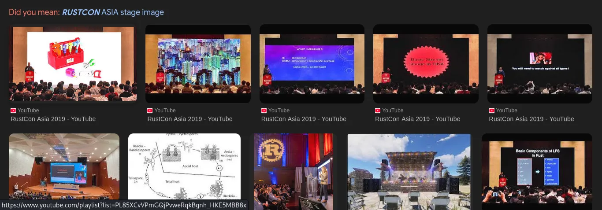

# Web

## Challenge Name : The Acme Corp

The flags are in segmented format :

The first part was found in client side html code :  
```html
<!-- build artifact:
       [1/5]=S3GM
       (note to self: admin panel moved, TODO remove robots entries)
  -->
```

The Second part was in style.css :
```css
/* build note:
   [2/5]=3NT_
*/
```

The third part was in app.js :
```text
build scratchpad:
   The release engineer left fragments here but reversed to be "compact":
   ]'3/5[' = ]'3R0F'[  // reversed Correct : F0R3
  */
```

The fourth part was in robots.txt :
```note
audit note:
# [4/5]=NS1C
```

The fifth part was in .htaccess :
```
#[5/5]=S
```
Final Flag : `flag{S3GM3NT_F0R3NS1CS}` **S was missing in the part**

# Crypto

## Shadows in the Wall 

We got a hex encoded text :
`2E2525233E233C3C31201E203D0C3D2F2D0B232C3D39`

First decode this from hex
Then from description we take first letter of each sentence then formed the key for **XOR**
which is `HIDDENINPLAINSIGHT`

flag : `flag{mural_is_the_key}`

## x^2+y^2=5 

This is a jsfive code 
```js
[$$=[+[]]]+[$$[++[[]][+[]]]=+[]]+[$$=[$$+[]][+[]][++[[]][+[]]]]+[$$$=[$[[[]+[][+[]]][+[]][++[++[++[++[[]][+[]]][+[]]][+[]]][+[]]]+[[]+[][+[]]][+[]][++[++[++[++[++[[]][+[]]][+[]]][+[]]][+[]]][+[]]]+[[]+[][+[]]][+[]][++[[]][+[]]]+[[]+[][+[]]][+[]][++[++[[]][+[]]][+[]]]]+[]][+[]]]+[$$$$=[$[[[]+[][+[]]][+[]][++[++[[]][+[]]][+[]]]+$$$[+[[++[++[++[++[++[[]][+[]]][+[]]][+[]]][+[]]][+[]]]+[++[++[++[++[++[++[[]][+[]]][+[]]][+[]]][+[]]][+[]]][+[]]]]]+$$$[++[++[++[++[[]][+[]]][+[]]][+[]]][+[]]]+$$$[+[[++[[]][+[]]]+[++[++[++[++[[]][+[]]][+[]]][+[]]][+[]]]]]+$$$[+[[++[++[++[++[++[++[++[++[++[[]][+[]]][+[]]][+[]]][+[]]][+[]]][+[]]][+[]]][+[]]][+[]]]+[++[++[++[++[++[++[++[++[[]][+[]]][+[]]][+[]]][+[]]][+[]]][+[]]][+[]]][+[]]]]]+[[]+[][+[]]][+[]][++[++[++[++[++[[]][+[]]][+[]]][+[]]][+[]]][+[]]]+$$$[++[++[++[[]][+[]]][+[]]][+[]]]+$$$[+[[++[++[++[++[++[++[++[++[++[[]][+[]]][+[]]][+[]]][+[]]][+[]]][+[]]][+[]]][+[]]][+[]]]+[++[++[++[++[++[++[[]][+[]]][+[]]][+[]]][+[]]][+[]]][+[]]]+[++[++[[]][+[]]][+[]]]]]+$$$[+[[++[[]][+[]]]+[++[++[++[++[[]][+[]]][+[]]][+[]]][+[]]]]]+$$$[+[[++[++[[]][+[]]][+[]]]+[++[++[++[++[[]][+[]]][+[]]][+[]]][+[]]]]]][[[]+[][+[]]][+[]][++[++[[]][+[]]][+[]]]+$$$[+[[++[++[++[++[++[++[++[++[++[[]][+[]]][+[]]][+[]]][+[]]][+[]]][+[]]][+[]]][+[]]][+[]]]+[++[++[++[++[++[++[++[++[[]][+[]]][+[]]][+[]]][+[]]][+[]]][+[]]][+[]]][+[]]]]]+$$$[+[[++[[]][+[]]]+[++[++[++[++[++[[]][+[]]][+[]]][+[]]][+[]]][+[]]]+[++[++[++[++[[]][+[]]][+[]]][+[]]][+[]]]]]+[[]+[][+[]]][+[]][++[++[++[++[++[[]][+[]]][+[]]][+[]]][+[]]][+[]]]+$$$[+[[++[++[++[++[++[[]][+[]]][+[]]][+[]]][+[]]][+[]]]+[++[++[++[++[++[[]][+[]]][+[]]][+[]]][+[]]][+[]]]]]]][+[]][+[]]]+[$$$$$=$$$[++[++[++[++[++[++[[]][+[]]][+[]]][+[]]][+[]]][+[]]][+[]]]+$$$[++[[]][+[]]]+$$$[++[++[++[++[[]][+[]]][+[]]][+[]]][+[]]]+$$$[+[[++[[]][+[]]]+[++[++[++[++[[]][+[]]][+[]]][+[]]][+[]]]]]+$$$[+[[++[++[[]][+[]]][+[]]]+[++[++[++[++[[]][+[]]][+[]]][+[]]][+[]]]]]+$$$[+[[++[++[++[++[++[[]][+[]]][+[]]][+[]]][+[]]][+[]]]+[++[++[++[++[++[[]][+[]]][+[]]][+[]]][+[]]][+[]]]+[++[++[++[++[++[++[++[++[[]][+[]]][+[]]][+[]]][+[]]][+[]]][+[]]][+[]]][+[]]]]]+$$$[+[[++[[]][+[]]]+[++[++[++[++[++[++[++[[]][+[]]][+[]]][+[]]][+[]]][+[]]][+[]]][+[]]]+[++[++[++[++[[]][+[]]][+[]]][+[]]][+[]]]]]+$$$[+[[++[++[++[++[++[[]][+[]]][+[]]][+[]]][+[]]][+[]]]+[++[++[++[++[++[++[[]][+[]]][+[]]][+[]]][+[]]][+[]]][+[]]]+[+[]]]]+$$$[+[[++[++[++[++[++[[]][+[]]][+[]]][+[]]][+[]]][+[]]]+[++[++[++[++[++[++[[]][+[]]][+[]]][+[]]][+[]]][+[]]][+[]]]+[++[[]][+[]]]]]]+[$$$$[$$$[++[++[++[++[++[++[[]][+[]]][+[]]][+[]]][+[]]][+[]]][+[]]]+$$$[+[[++[[]][+[]]]+[+[]]+[++[++[++[++[[]][+[]]][+[]]][+[]]][+[]]]]]+[[]+[][+[]]][+[]][++[[]][+[]]]+$$$[+[[++[[]][+[]]]+[++[++[++[++[[]][+[]]][+[]]][+[]]][+[]]]]]+$$$[+[[++[++[[]][+[]]][+[]]]+[++[++[++[++[[]][+[]]][+[]]][+[]]][+[]]]]]+$$$[+[[++[[]][+[]]]+[++[++[++[++[++[[]][+[]]][+[]]][+[]]][+[]]][+[]]]+[++[++[++[++[[]][+[]]][+[]]][+[]]][+[]]]]]+$$$[++[++[++[++[++[++[[]][+[]]][+[]]][+[]]][+[]]][+[]]][+[]]]+$$$[++[++[++[[]][+[]]][+[]]][+[]]]+$$$[++[[]][+[]]]+$$$[+[[++[++[++[++[++[[]][+[]]][+[]]][+[]]][+[]]][+[]]]+[++[++[++[++[++[++[++[++[++[[]][+[]]][+[]]][+[]]][+[]]][+[]]][+[]]][+[]]][+[]]][+[]]]]]+$$$[+[[++[[]][+[]]]+[++[++[++[++[[]][+[]]][+[]]][+[]]][+[]]]]]+[[]+[][+[]]][+[]][++[[]][+[]]]+$$$[++[++[++[++[[]][+[]]][+[]]][+[]]][+[]]]][$$$[+[[++[[]][+[]]]+[++[[]][+[]]]+[++[++[++[++[++[++[++[[]][+[]]][+[]]][+[]]][+[]]][+[]]][+[]]][+[]]]+[++[++[++[++[++[++[++[++[[]][+[]]][+[]]][+[]]][+[]]][+[]]][+[]]][+[]]][+[]]]]]+$$$[++[++[++[++[++[++[[]][+[]]][+[]]][+[]]][+[]]][+[]]][+[]]]+[[]+[][+[]]][+[]][++[++[[]][+[]]][+[]]]+$$$[+[[++[[]][+[]]]+[++[++[++[++[++[++[++[[]][+[]]][+[]]][+[]]][+[]]][+[]]][+[]]][+[]]]+[++[++[++[++[++[[]][+[]]][+[]]][+[]]][+[]]][+[]]]]]][[[]+[][+[]]][+[]][++[++[++[++[++[[]][+[]]][+[]]][+[]]][+[]]][+[]]]+[[]+[][+[]]][+[]][++[[]][+[]]]+[[]+[][+[]]][+[]][++[[]][+[]]]+$$$[+[[++[[]][+[]]]+[++[++[++[++[[]][+[]]][+[]]][+[]]][+[]]]]]+$$$[+[[++[++[[]][+[]]][+[]]]+[++[++[++[++[[]][+[]]][+[]]][+[]]][+[]]]]]+$$$[+[[++[++[++[++[++[[]][+[]]][+[]]][+[]]][+[]]][+[]]]+[++[++[++[++[++[[]][+[]]][+[]]][+[]]][+[]]][+[]]]+[++[++[++[++[++[++[++[++[[]][+[]]][+[]]][+[]]][+[]]][+[]]][+[]]][+[]]][+[]]]]]+$$$[+[[++[[]][+[]]]+[++[++[++[++[++[++[++[[]][+[]]][+[]]][+[]]][+[]]][+[]]][+[]]][+[]]]+[++[++[++[++[[]][+[]]][+[]]][+[]]][+[]]]]]+$$$[+[[++[++[++[++[++[[]][+[]]][+[]]][+[]]][+[]]][+[]]]+[++[++[++[++[++[++[[]][+[]]][+[]]][+[]]][+[]]][+[]]][+[]]]+[+[]]]]+$$$[+[[++[++[++[++[++[[]][+[]]][+[]]][+[]]][+[]]][+[]]]+[++[++[++[++[++[++[[]][+[]]][+[]]][+[]]][+[]]][+[]]][+[]]]+[++[[]][+[]]]]]]+=$$$$[$$$$$][+[]]+[[]+[][+[]]][+[]][++[++[++[++[++[[]][+[]]][+[]]][+[]]][+[]]][+[]]]+$$$[+[[++[++[++[++[++[[]][+[]]][+[]]][+[]]][+[]]][+[]]]+[++[++[++[++[++[++[++[++[++[[]][+[]]][+[]]][+[]]][+[]]][+[]]][+[]]][+[]]][+[]]][+[]]]]]+$$$[+[[++[++[++[++[++[++[++[++[++[[]][+[]]][+[]]][+[]]][+[]]][+[]]][+[]]][+[]]][+[]]][+[]]]+[++[++[++[++[[]][+[]]][+[]]][+[]]][+[]]]]]+$$$[++[++[++[++[++[++[++[++[[]][+[]]][+[]]][+[]]][+[]]][+[]]][+[]]][+[]]][+[]]]+$$$[+[[++[[]][+[]]]+[++[++[++[++[++[++[++[[]][+[]]][+[]]][+[]]][+[]]][+[]]][+[]]][+[]]]]]+$$$[+[[++[++[[]][+[]]][+[]]]+[++[++[++[++[[]][+[]]][+[]]][+[]]][+[]]]]]+$$$[++[++[++[[]][+[]]][+[]]][+[]]]+$$$[++[++[++[++[++[++[++[++[[]][+[]]][+[]]][+[]]][+[]]][+[]]][+[]]][+[]]][+[]]]+$$$[++[++[++[++[++[++[[]][+[]]][+[]]][+[]]][+[]]][+[]]][+[]]]+[[]+[][+[]]][+[]][++[[]][+[]]]+$$$[+[[++[[]][+[]]]+[++[++[++[++[[]][+[]]][+[]]][+[]]][+[]]]]]+$$$[+[[++[++[[]][+[]]][+[]]]+[++[++[++[++[[]][+[]]][+[]]][+[]]][+[]]]]]+$$$[+[[++[++[[]][+[]]][+[]]]+[++[++[++[++[[]][+[]]][+[]]][+[]]][+[]]]]]+$$$[++[++[++[++[++[++[[]][+[]]][+[]]][+[]]][+[]]][+[]]][+[]]]+$$$[+[[++[++[[]][+[]]][+[]]]+[++[++[++[++[[]][+[]]][+[]]][+[]]][+[]]]]]+$$$$[$$$$$][++[++[++[++[++[++[++[[]][+[]]][+[]]][+[]]][+[]]][+[]]][+[]]][+[]]]+$$$$[$$$$$][++[++[++[++[++[++[++[++[[]][+[]]][+[]]][+[]]][+[]]][+[]]][+[]]][+[]]][+[]]]+$$$[+[[++[[]][+[]]]+[++[++[++[++[[]][+[]]][+[]]][+[]]][+[]]]]]+$$$[+[[++[++[++[++[++[[]][+[]]][+[]]][+[]]][+[]]][+[]]]+[++[++[++[++[++[[]][+[]]][+[]]][+[]]][+[]]][+[]]]]]+$$$[+[[++[++[++[++[++[[]][+[]]][+[]]][+[]]][+[]]][+[]]]+[++[++[++[++[++[++[[]][+[]]][+[]]][+[]]][+[]]][+[]]][+[]]]]]+$$$[+[[++[[]][+[]]]+[++[++[++[[]][+[]]][+[]]][+[]]]]]+$$$[+[[++[[]][+[]]]+[++[++[++[++[++[[]][+[]]][+[]]][+[]]][+[]]][+[]]]]]+$$[$$$[++[++[++[[]][+[]]][+[]]][+[]]]+$$$[++[++[++[++[++[++[[]][+[]]][+[]]][+[]]][+[]]][+[]]][+[]]]+[[]+[][+[]]][+[]][++[[]][+[]]]+$$$[+[[++[[]][+[]]]+[++[++[++[++[++[++[++[[]][+[]]][+[]]][+[]]][+[]]][+[]]][+[]]][+[]]]]]+$$$[++[++[++[++[[]][+[]]][+[]]][+[]]][+[]]]+$$$[+[[++[++[[]][+[]]][+[]]]+[++[++[++[++[[]][+[]]][+[]]][+[]]][+[]]]]]+$$$[++[[]][+[]]]+$$$[++[++[++[[]][+[]]][+[]]][+[]]]+$$$[++[++[++[++[[]][+[]]][+[]]][+[]]][+[]]]+$$$[++[++[++[++[++[++[[]][+[]]][+[]]][+[]]][+[]]][+[]]][+[]]]+$$$[+[[++[++[[]][+[]]][+[]]]+[++[++[++[++[[]][+[]]][+[]]][+[]]][+[]]]]]][[[]+[][+[]]][+[]][++[[]][+[]]]+$$$[+[[++[++[++[++[++[[]][+[]]][+[]]][+[]]][+[]]][+[]]]+[++[++[++[++[++[++[[]][+[]]][+[]]][+[]]][+[]]][+[]]][+[]]]]]+$$$[+[[++[++[++[++[++[[]][+[]]][+[]]][+[]]][+[]]][+[]]]+[++[++[++[++[++[++[++[++[++[[]][+[]]][+[]]][+[]]][+[]]][+[]]][+[]]][+[]]][+[]]][+[]]]]]+$$$[+[[++[[]][+[]]]+[++[++[++[++[[]][+[]]][+[]]][+[]]][+[]]]]]]+$$$[+[[++[[]][+[]]]+[++[++[++[++[[]][+[]]][+[]]][+[]]][+[]]]+[++[++[++[++[++[++[++[++[[]][+[]]][+[]]][+[]]][+[]]][+[]]][+[]]][+[]]][+[]]]]]+[[]+[][+[]]][+[]][++[++[++[++[[]][+[]]][+[]]][+[]]][+[]]]+$$$[+[[++[++[[]][+[]]][+[]]]+[++[++[++[++[[]][+[]]][+[]]][+[]]][+[]]]]]+$$$[++[++[++[++[++[++[[]][+[]]][+[]]][+[]]][+[]]][+[]]][+[]]]+$$$[+[[++[++[++[++[++[[]][+[]]][+[]]][+[]]][+[]]][+[]]]+[++[++[++[++[++[++[++[++[++[[]][+[]]][+[]]][+[]]][+[]]][+[]]][+[]]][+[]]][+[]]][+[]]]]]+$$$[+[[++[[]][+[]]]+[++[++[[]][+[]]][+[]]]+[+[]]]]+$$$[+[[++[++[++[++[++[++[++[++[++[[]][+[]]][+[]]][+[]]][+[]]][+[]]][+[]]][+[]]][+[]]][+[]]]+[++[[]][+[]]]]]+$$$[+[[++[++[++[++[++[[]][+[]]][+[]]][+[]]][+[]]][+[]]]+[++[++[++[++[++[++[[]][+[]]][+[]]][+[]]][+[]]][+[]]][+[]]]]]+$$$[+[[++[++[[]][+[]]][+[]]]+[++[++[++[++[[]][+[]]][+[]]][+[]]][+[]]]]]+$$$[+[[++[[]][+[]]]+[++[++[[]][+[]]][+[]]]+[+[]]]]+$$$[++[++[++[++[++[++[[]][+[]]][+[]]][+[]]][+[]]][+[]]][+[]]]+[[]+[][+[]]][+[]][++[++[[]][+[]]][+[]]]+$$$[+[[++[[]][+[]]]+[++[++[++[++[[]][+[]]][+[]]][+[]]][+[]]]]]+$$$[+[[++[[]][+[]]]+[++[++[++[++[++[[]][+[]]][+[]]][+[]]][+[]]][+[]]]]]+[[+[[++[++[++[++[++[++[++[++[++[[]][+[]]][+[]]][+[]]][+[]]][+[]]][+[]]][+[]]][+[]]][+[]]]+[++[++[++[++[++[++[++[[]][+[]]][+[]]][+[]]][+[]]][+[]]][+[]]][+[]]]]][+[]]+$$+[+[[++[[]][+[]]]+[+[]]+[++[++[++[++[++[++[++[++[[]][+[]]][+[]]][+[]]][+[]]][+[]]][+[]]][+[]]][+[]]]]][+[]]+$$+[+[[++[[]][+[]]]+[+[]]+[++[[]][+[]]]]][+[]]+$$+[+[[++[[]][+[]]]+[++[[]][+[]]]+[++[++[++[++[[]][+[]]][+[]]][+[]]][+[]]]]][+[]]+$$+[+[[++[[]][+[]]]+[++[[]][+[]]]+[++[++[++[++[++[++[[]][+[]]][+[]]][+[]]][+[]]][+[]]][+[]]]]][+[]]+$$+[+[[++[++[++[++[[]][+[]]][+[]]][+[]]][+[]]]+[+[]]]][+[]]+$$+[+[[++[++[++[[]][+[]]][+[]]][+[]]]+[++[++[++[++[[]][+[]]][+[]]][+[]]][+[]]]]][+[]]+$$+[+[[++[[]][+[]]]+[+[]]+[++[++[[]][+[]]][+[]]]]][+[]]+$$+[+[[++[[]][+[]]]+[+[]]+[++[++[++[++[++[++[++[++[[]][+[]]][+[]]][+[]]][+[]]][+[]]][+[]]][+[]]][+[]]]]][+[]]+$$+[+[[++[++[++[++[++[++[++[++[++[[]][+[]]][+[]]][+[]]][+[]]][+[]]][+[]]][+[]]][+[]]][+[]]]+[++[++[++[++[++[++[++[[]][+[]]][+[]]][+[]]][+[]]][+[]]][+[]]][+[]]]]][+[]]+$$+[+[[++[[]][+[]]]+[+[]]+[++[++[++[[]][+[]]][+[]]][+[]]]]][+[]]+$$+[+[[++[[]][+[]]]+[++[++[[]][+[]]][+[]]]+[++[++[++[[]][+[]]][+[]]][+[]]]]][+[]]+$$+[+[[++[++[++[++[++[++[++[++[[]][+[]]][+[]]][+[]]][+[]]][+[]]][+[]]][+[]]][+[]]]+[++[++[++[++[++[++[++[++[++[[]][+[]]][+[]]][+[]]][+[]]][+[]]][+[]]][+[]]][+[]]][+[]]]]][+[]]+$$+[+[[++[[]][+[]]]+[++[[]][+[]]]+[++[[]][+[]]]]][+[]]+$$+[+[[++[[]][+[]]]+[++[[]][+[]]]+[++[++[++[++[++[++[++[[]][+[]]][+[]]][+[]]][+[]]][+[]]][+[]]][+[]]]]][+[]]+$$+[+[[++[++[++[++[++[++[++[++[++[[]][+[]]][+[]]][+[]]][+[]]][+[]]][+[]]][+[]]][+[]]][+[]]]+[++[++[++[++[++[[]][+[]]][+[]]][+[]]][+[]]][+[]]]]][+[]]+$$+[+[[++[++[++[++[++[++[++[++[++[[]][+[]]][+[]]][+[]]][+[]]][+[]]][+[]]][+[]]][+[]]][+[]]]+[++[++[++[++[++[++[++[[]][+[]]][+[]]][+[]]][+[]]][+[]]][+[]]][+[]]]]][+[]]+$$+[+[[++[[]][+[]]]+[++[[]][+[]]]+[++[++[++[++[[]][+[]]][+[]]][+[]]][+[]]]]][+[]]+$$+[+[[++[[]][+[]]]+[+[]]+[++[[]][+[]]]]][+[]]+$$+[+[[++[++[++[++[++[++[++[++[++[[]][+[]]][+[]]][+[]]][+[]]][+[]]][+[]]][+[]]][+[]]][+[]]]+[++[++[++[++[++[[]][+[]]][+[]]][+[]]][+[]]][+[]]]]][+[]]+$$+[+[[++[++[++[++[++[++[++[++[++[[]][+[]]][+[]]][+[]]][+[]]][+[]]][+[]]][+[]]][+[]]][+[]]]+[++[++[++[++[++[++[++[[]][+[]]][+[]]][+[]]][+[]]][+[]]][+[]]][+[]]]]][+[]]+$$+[+[[++[++[++[++[++[++[++[++[++[[]][+[]]][+[]]][+[]]][+[]]][+[]]][+[]]][+[]]][+[]]][+[]]]+[++[++[++[++[++[[]][+[]]][+[]]][+[]]][+[]]][+[]]]]][+[]]+$$+[+[[++[++[++[++[[]][+[]]][+[]]][+[]]][+[]]]+[++[++[++[++[++[++[++[++[++[[]][+[]]][+[]]][+[]]][+[]]][+[]]][+[]]][+[]]][+[]]][+[]]]]][+[]]+$$+[+[[++[++[++[++[++[[]][+[]]][+[]]][+[]]][+[]]][+[]]]+[++[[]][+[]]]]][+[]]+$$+[+[[++[++[++[++[++[[]][+[]]][+[]]][+[]]][+[]]][+[]]]+[++[[]][+[]]]]][+[]]+$$+[+[[++[++[++[++[++[[]][+[]]][+[]]][+[]]][+[]]][+[]]]+[++[++[++[++[++[[]][+[]]][+[]]][+[]]][+[]]][+[]]]]][+[]]+$$+[+[[++[++[++[++[++[++[++[++[++[[]][+[]]][+[]]][+[]]][+[]]][+[]]][+[]]][+[]]][+[]]][+[]]]+[++[++[++[++[++[[]][+[]]][+[]]][+[]]][+[]]][+[]]]]][+[]]+$$+[+[[++[[]][+[]]]+[+[]]+[+[]]]][+[]]+$$+[+[[++[++[++[++[++[[]][+[]]][+[]]][+[]]][+[]]][+[]]]+[++[[]][+[]]]]][+[]]+$$+[+[[++[++[++[++[++[++[++[++[++[[]][+[]]][+[]]][+[]]][+[]]][+[]]][+[]]][+[]]][+[]]][+[]]]+[++[++[++[++[++[++[++[++[++[[]][+[]]][+[]]][+[]]][+[]]][+[]]][+[]]][+[]]][+[]]][+[]]]]][+[]]+$$+[+[[++[++[++[++[[]][+[]]][+[]]][+[]]][+[]]]+[++[++[++[++[++[++[++[++[[]][+[]]][+[]]][+[]]][+[]]][+[]]][+[]]][+[]]][+[]]]]][+[]]+$$+[+[[++[[]][+[]]]+[+[]]+[+[]]]][+[]]+$$+[+[[++[++[++[++[++[[]][+[]]][+[]]][+[]]][+[]]][+[]]]+[++[[]][+[]]]]][+[]]+$$+[+[[++[[]][+[]]]+[++[[]][+[]]]+[++[++[++[++[[]][+[]]][+[]]][+[]]][+[]]]]][+[]]+$$+[+[[++[[]][+[]]]+[++[++[[]][+[]]][+[]]]+[++[++[++[++[++[[]][+[]]][+[]]][+[]]][+[]]][+[]]]]][+[]]+$$+[+[[++[++[++[[]][+[]]][+[]]][+[]]]+[++[++[++[++[[]][+[]]][+[]]][+[]]][+[]]]]][+[]]+$$+[+[[++[++[++[++[[]][+[]]][+[]]][+[]]][+[]]]+[++[[]][+[]]]]][+[]]][+[]]+$$$[+[[++[++[++[++[++[[]][+[]]][+[]]][+[]]][+[]]][+[]]]+[+[]]]]+$$$[+[[++[++[++[++[++[[]][+[]]][+[]]][+[]]][+[]]][+[]]]+[+[]]]]+$$$$[$$$$$][++[++[++[++[++[++[++[++[[]][+[]]][+[]]][+[]]][+[]]][+[]]][+[]]][+[]]][+[]]]+$$$$[$$$$$][+[[++[[]][+[]]]+[++[[]][+[]]]+[+[]]]]]
```

on putting this on this website : https://aem1k.com/five/

We got the flag : `flag{You_are_a_1337_d3c0d3r}`

## Secret Message

I attempted to implement RSA encryption with small values for simplicity. Can you help me decrypt the ciphertext? The parameters are: n=3233 e=17 c=1306 Find the original plaintext message. Submit your answer in the format: Solve this
The above was the description that it is a RSA challenge.. I gave chatgpt to write a script for to extract the correct number from above values:
```python
# RSA decryption example

# Given parameters
n = 3233
e = 17
c = 1306

# Step 1: Factor n = p * q
p = 61
q = 53

# Step 2: Compute phi(n)
phi = (p - 1) * (q - 1)

# Step 3: Compute modular inverse of e mod phi(n)
def mod_inverse(a, m):
    # Extended Euclidean Algorithm
    t, new_t = 0, 1
    r, new_r = m, a
    while new_r != 0:
        quotient = r // new_r
        t, new_t = new_t, t - quotient * new_t
        r, new_r = new_r, r - quotient * new_r
    if r > 1:
        raise ValueError("No inverse exists")
    if t < 0:
        t += m
    return t

d = mod_inverse(e, phi)

# Step 4: Decrypt ciphertext
m = pow(c, d, n)

print("Decryption exponent d:", d)
print("Plaintext message m:", m)

## Plain Text: 1337
```
flag : `flag{1337}`

## Factor's

From factor.db I found the p and q 
In dcode.fr/rsa site I put all the values 

```
n = 408579146706567976063586763758203051093687666875502812646277701560732347095463873824829467529879836457478436098685606552992513164224712398195503564207485938278827523972139196070431397049700119503436522251010430918143933255323117421712000644324381094600257291929523792609421325002527067471808992410166917641057703562860663026873111322556414272297111644069436801401012920448661637616392792337964865050210799542881102709109912849797010633838067759525247734892916438373776477679080154595973530904808231
e = 65537
c = 321032879323205327725702473173186126139806349977995355851770555368773987337788381305330715691451675233822332788148678876695658947721063822106013968982141117811060606096601702756749928977440152428256556701812213214485306880463012248237572289090239204812320882132872241252415408250039824898913320655846342475805127699401297961693171893817378737598710752083615027737006555198517143730812880793088207442754977911029461994184058346013879033290267049619197891732832973720711195278508885239645327100743130


p = 15485863
q = 263840088670917452946333545478352127416914166730974445948719617086068982461916312849228659410121241843272432475145625757 500575308088875898098480894611741004217089821840822946755005773362259577979888187213725467491313808765661376070363014734 357640316590852761599094472558243169917315597762816959190564269902851202779503255987007705881523305657745462196113601677 479009675113787095763660567278662393597444843430993224406744340208742005940410339262025789415089695962293981599655815213 26643115137
```

Then I got the flag : `flag{kiet_sh0uld'v3_t4k3n_b1gg3r_pr1m3s_xd}`

## Math 

I was trying to implement RSA encryption again. I learnt my lesson from last time, so I'm not just using simple numbers... Can you help me recover the message? Here's what I used: n = 12407072677633161347 e = 65537 c = 6680131599371095691

Again I tried in factor.db and tried to factorise and n and got p

`p=3078160451`

Then while in dcode.fr/rsa it was giving some random number : 727361
After trying to understand it I tried to divide then into pair(1 byte) which hex values give me : rsa (got from cyberchef.io)

FLAG: `flag{rsa}`
## clean_secrets 

Using this script from AI I decrypt the flag as only first some parts are flag and then padding was there 
```python
# RSA signature verification and ASCII character output

e = 65537
n = 29272211185791337470601459865547915572705405074737448165554838548593414777186862322360266396503949588399211978684110028692178124348659022347925865586858857745046980867426705555580364865219468822048313765397195531031542876514446065112877624125765279978999006068867591708338040814923453793785950485219534236427095229380429852683155646321025259419045010795522308637833753510147498752683522318021290578396732008492148002481783070584916418311934016850189529538209785082364073383572848357382062832206142447578010522255643508500605964292519075059674070329541053216687386862501985569949181471733055512716848634213404812305467
sign = 28823527877009404391788009303283758068711379074425201137344940811998934078583167587041482766136924878930695190381296276633373217706755888004430290379533125655122691697171011539214176791406923545245432013886712782232147882041317072208170830413141936709786452545173666025140566880221801368817252874213105392976532941665834879566180285905133499823156214691343651581978074424317672823183441938255275518500290759593740726421853728061784549242702675311865773009409195146565935528082068227978113561192763132802645856604678491872926128999509590907870281571659146454537850484613719932986098559922816859832679101469594354477869

# Step 1: RSA public operation (decode signature)
decoded = pow(sign, e, n)

# Step 2: Convert to bytes
decoded_bytes = decoded.to_bytes((decoded.bit_length() + 7) // 8, 'big')

# Step 3: Print each byte as integer and character (if printable)
for b in decoded_bytes:
    if 32 <= b <= 126:  # printable ASCII range
        print(f"{b} -> '{chr(b)}'")
    else:
        print(f"{b} -> (non-printable)")
'''
102 -> 'f'
108 -> 'l'
97 -> 'a'
103 -> 'g'
123 -> '{'
105 -> 'i'
109 -> 'm'
95 -> '_'
115 -> 's'
101 -> 'e'
97 -> 'a'
114 -> 'r'
99 -> 'c'
104 -> 'h'
105 -> 'i'
110 -> 'n'
103 -> 'g'
95 -> '_'
102 -> 'f'
111 -> 'o'
114 -> 'r'
95 -> '_'
97 -> 'a'
95 -> '_'
110 -> 'n'
101 -> 'e'
119 -> 'w'
95 -> '_'
104 -> 'h'
97 -> 'a'
115 -> 's'
104 -> 'h'
105 -> 'i'
110 -> 'n'
103 -> 'g'
95 -> '_'
102 -> 'f'
117 -> 'u'
110 -> 'n'
99 -> 'c'
116 -> 't'
105 -> 'i'
111 -> 'o'
110 -> 'n'
125 -> '}'

'''
```

flag:  `flag{im_searching_for_a_new_hashing_function}`

# Forensics 

## Echoes in the Deep

We are given a .zip file but when playing with `aplay` it was hinting for morse code

So change the extension from .zip to .wav and in any morse code decoder put it:

flag: `flag{s1gn4ls_fr0m_th3_d33p}`

## Fractured Truth 

We are given a bunch of parts of a qr code...

We have to manually place it in correct order and scan to get the flag..

After a lot of trial and error I found the correct combination...

flag: `flag{puzzl3d_qr_c0mpl3t3`

## Capture 1 

We are given a pcapng file....

While exploring all protocols in **ICMP** protocol I found something dot,space,dash...

So I extracted all the packets
```bash
──(kirit0_㉿m4ch1n3)-[~/CTF/cybersecure2.0]
└─$ tshark -r cap1.pcapng -Y "icmp" -T fields -e data | xxd -r -p 

␦1234567␦1234567␦1234567␦1234567␦1234567␦1234567␦1234567␦1234567␦1234567␦1234567␦1234567␦1234567␦1234567␦1234567␦1234567␦1234567␦1234567␦1234567␦1234567␦1234567␦1234567␦1234567␦1234567␦1234567␦1234567␦1234567␦1234567␦1234567␦1234567␦1234567␦1234567␦1234567␦1234567␦1234567␦1234567␦1234567␦1234567␦1234567␦1234567␦1234567␦1234567␦1234567␦1234567␦1234567␦1234567␦1234567␦1234567␦1234567␦1234567␦1234567␦1234567␦1234567␦1234567␦1234567␦1234567␦1234567␦1234567␦1234567␦1234567␦1234567␦1234567␦1234567␦1234567␦1234567␦1234567␦1234567␦1234567␦1234567␦1234567␦1234567␦1234567␦1234567␦1234567␦1234567␦1234567␦1234567␦1234567␦1234567␦1234567␦1234567␦1234567␦1234567␦1234567␦1234567␦1234567␦1234567␦1234567␦1234567␦1234567␦1234567␦1234567␦1234567␦1234567␦1234567␦1234567␦1234567␦1234567␦1234567␦1234567␦1234567␦1234567␦1234567␦1234567␦1234567␦1234567␦1234567␦1234567␦1234567␦1234567␦1234567␦1234567␦1234567␦1234567␦1234567␦1234567␦1234567␦1234567␦1234567␦1234567␦1234567␦1234567␦1234567␦1234567␦1234567␦1234567␦1234567␦1234567␦1234567␦1234567␦1234567␦1234567␦1234567␦1234567␦1234567␦1234567␦1234567␦1234567␦1234567␦1234567␦1234567␦1234567␦1234567␦1234567␦1234567␦1234567␦1234567␦1234567␦1234567␦1234567␦1234567␦1234567␦1234567␦1234567␦1234567␦1234567␦1234567␦1234567␦1234567␦1234567␦1234567␦1234567␦1234567␦1234567␦1234567␦1234567␦1234567␦1234567␦1234567␦1234567␦1234567␦1234567␦1234567␦1234567␦1234567␦1234567␦1234567dotdotdashdotspacedotdashdotdotspacedotdashspacedashdashdotspacespacespacedashspacedotdot␦1234567␦1234567dotdashdashspacedotdashdotdotspacedotdotdotdashdashspacedashdashdotspacedotdashdotspacedotdotdotdotdashspacedashdashspacespacespacedotdotdashdotspacedashspacedotdashdashspacespace␦1234567␦1234567␦1234567␦1234567␦1234567␦1234567␦1234567␦1234567␦1234567␦1234567␦1234567␦1234567␦1234567␦1234567␦1234567␦1234567␦1234567␦1234567␦1234567␦1234567␦1234567␦1234567␦1234567␦1234567␦1234567␦1234567␦1234567␦1234567␦1234567␦1234567␦1234567␦1234567␦1234567␦1234567␦1234567␦1234567␦1234567␦1234567␦1234567␦1234567␦1234567␦1234567␦1234567␦1234567␦1234567␦1234567␦1234567␦1234567␦1234567␦1234567␦1234567␦1234567␦1234567␦1234567␦1234567␦1234567␦1234567␦1234567␦1234567␦1234567␦1234567␦1234567␦1234567␦1234567␦1234567␦1234567␦1234567␦1234567␦1234567␦1234567      
```

Then replacing with the corresponding symbols we got :
` ..-. .-.. .- --. - ...-- .-.. ...-- --. .-. ....- -- ..-. - .--`

Flag : FLAGT3L3GR4MFTW                    `flag{t3l3gr4m_ftw}`

## Capture 2

I opened the file.pcapng with wireshark and analysed every protocols TCP,UDP,QUIC,ICMPv6... but got nothing..

Then while filtering I found something wrong with **ARP** packets, a huge number of arp packets are originating from same source.


So using Tshark I extracted all ARP packets 

```bash
┌──(kirit0_㉿m4ch1n3)-[~/CTF/cybersecure2.0]
└─$ tshark -r file.pcapng -Y arp -T fields -e arp.src.proto_ipv4 \
  | awk -F. '{print $4}' \
  | while read n; do printf "\\$(printf '%03o' $n)"; done
echo

�	�	�	�	�	�	�	�	hahatryagainbaby�	��	�	�	�	�	flag{addr3ss_res0lv3d_bu7_n0t_issues}�	---> Got the flag

```

# Misc

## Plug and Play

Here we are given a windows2000 ova file... and told that there is shady driver its IOCTL handler leaks secrets if you poke it the right way.

So after opening the VM file I search for a tool WinObj which allows us to view drivers as objects in windows...

In that I found a driver named as leakydrv...

Every drive has its own `.sys`(System file), So I search for it and found it...

And on doing `strings` we got this flag...


# OSINT

## Three_day_invasion (200 Points)

Pretty simple, just reverse search the image, you will get it in X(formerly
twitter)


Flag: flag{jembobineuse}

## Lost in Dusts (300 Points)

Reverse search on google, it’s sandwedges in Ghaziabad


Pretty classic, went to google map reviews, sorted by newest and found the
flag in recent review

Flag: flag{rusted_lotus_47}

## Just Search It Writeup

so today we are going to discuss about the CTF  OSINT challenge of just search it (points - 200) organized by cybersecure

At First we got this webp file showing a bunch of people attending a session and if we carefully look in the bottom left we can see the sign says something like __con. 

1. First i copy pasted the code in the screen in github but no luck
2. second when i tried to read the code there a [file.rs](http://file.rs) mentioned and i search it and i get to know it is a rust program  

 


### The Rust Code

```
error[E0308]: mismatched types
  --> file.rs:3:9
   |
3  |   foo(&x);
   |   ^^^^ expected usize, found u32
   |
   = note: expected type `&usize`
              found type `&u32`
error: aborting due to previous error
```

if we look carefully there a speaker discussing this rust code with an audience ..the poster where the speaker is cropped but we can identify its a Con as in defcon nullcon conferences .. i started searching for every type of conf and started searching their stage image no luck finding any match but i searched for RUSTCON and just a bit of guess regarding the A in the image i went with “RUSTCON ASIA” and yeh same to same stage images 

  



# Youtube Video 0f RUSTCON 2019


Got to Know the speaker is Nick cameron and he has a github profile….


after that i just searched “flag{” and found the flag pushed in issues 


*flag*{f0und_th3_s0urc3_l1k3_a_b0ss}

# Steganography

## Layers of Silence (200 Points)

Another classic challenge, from hints in challenge description, I knew it would
be LSB, so I used zsteg. Found encrypted text


it was Base 58, so converted


Flag: flag{STEREO_SECRET}
